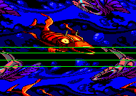
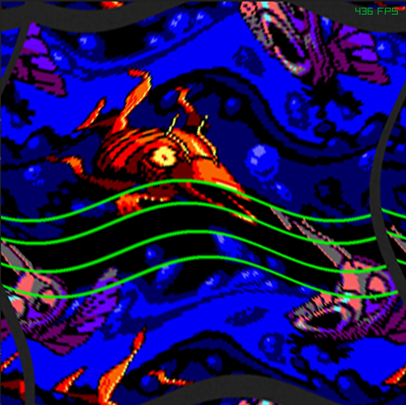

# raylib-compute-shader-old-school-plasma-effect

A old-school plasma effect rendered from a compute shader. WIP

A first glimpse of a compute shader retro from the famous and impressive One-Screen-Colony CPC demo:

the same effect on a HD image

bi directional displacement

